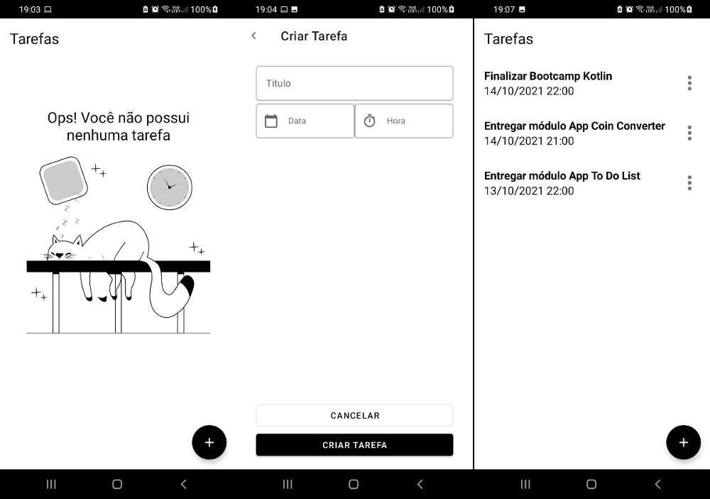

# Kotlin To Do List

- Instrutor: [Ezequiel Messore](https://www.linkedin.com/in/ezequielmessore)
- Repositório original: [To-Do-List](https://github.com/EzequielMessore/To-Do-List)
- Plataforma de Ensino: [Digital Innovation One](https://digitalinnovation.one/sign-up?ref=K5EF2VCVKA)
- Módulo Criando um App de Lembretes e Tarefas com Kotlin - Dio Bootcamp Carrefour Dev Android

## Vídeo Explicativo

  [Youtube](https://youtu.be/BjmvLhxPmQQ)

##  Objetivo

- Aplicação destinada à prática do módulo "Criando um App de Lembretes e Tarefas com Kotlin".
- Criação de um App no estilo "To Do List" do zero em Kotlin.
- Implementação de funcionalidades não tratadas no módulo.
	- [ok] nova tarefa -> ao salvar uma tarefa sem descrição, exibir uma caixa de erro e não permitir salvar.
	- [ok] editar tarefa -> exibir os elementos MaterialDatePicker e MaterialTimePicker com os valores já atribuídos na tarefa.
	- [ok] editar tarefa -> ajuste no elemento MaterialDatePicker para não quebrar o layout em 2 linhas.
	- [ok] editar tarefa -> exibir o texto do botão de ação para editar ou criar, dependendo da funcionalidade escolhida.
	- [ok] editar tarefa -> após salvar, atualizar listagem com o conteúdo da tarefa modificado.
	- [ok] editar tarefa -> adicionar evento no botão de voltar.
	- [  ] persistência dos dados

## Tecnologias Utilizadas

- [Kotlin](https://kotlinlang.org/docs/getting-started.html)
- [Android Studio](https://developer.android.com/studio/intro)
- [Material Design](https://material.io/design)
- [GitFlow](https://medium.com/trainingcenter/utilizando-o-fluxo-git-flow-e63d5e0d5e04)

## Conteúdo apresentado

- Etapa 1
    - Configuração inicial do projeto
- Etapa 2
    - Um pouco do [Android Studio](https://developer.android.com/studio/intro)
- Etapa 3
    - Temas
      - [Documentação dos temas](https://developer.android.com/guide/topics/ui/look-and-feel/themes?hl=pt-br)
      - Link de referência do [stackoverflow](https://stackoverflow.com/questions/22192291/how-to-change-the-status-bar-color-in-android/24997241#24997241)
      - Customização do Floating Action Button [stackoverflow](https://stackoverflow.com/questions/30969455/android-changing-floating-action-button-color/56158913#56158913)
    - Começando por a mão na massa
      - [Protótipo](https://xd.adobe.com/view/77c56d1f-232d-41e9-a220-371d51991646-2296/)
      - [Material Design](https://material.io/design)
    - Criando a tela criar tarefas
    - ViewBinding e DatePicker
      - [Documentação do View Binding](https://developer.android.com/topic/libraries/view-binding)
      - [Artigo sobre View Binding](https://medium.com/androiddevelopers/use-view-binding-to-replace-findviewbyid-c83942471fc)
    - Time Picker
      - Problema com o TimeZone [stackoverflow](https://stackoverflow.com/a/60979837)
    - RecyclerView
      - Documentação do [RecyclerView](https://developer.android.com/guide/topics/ui/layout/recyclerview?hl=pt-br)
    - Mostrando lista de tarefas
      - [Material Popup menu](https://material.io/components/menus#usage)
    - Editando tarefas
    - Finalizando o app
       - [Material Empty States](https://material.io/design/communication/empty-states.html#content)

## Desafio proposto (TODO)

Tornar nosso aplicativo um aplicativo resiliente que não perca nossas tarefas salvas quando é encerrado, para isto podemos usar a estratégia de salvar nossos dados localmente.
Podemos fazer isto de duas maneiras usar nossas [Shared Preferences](https://developer.android.com/training/data-storage/shared-preferences?hl=pt-br) ou nosso [SQLite](https://developer.android.com/training/data-storage/sqlite) para utilizar esses conceitos de uma maneira facilitada devemos usar as seguintes bibliotecas:

 - [Room](https://developer.android.com/training/data-storage/room): é um banco de dados que oferece uma camada de abstração sobre o SQLite, e nos ajuda a lidar melhor com a complexidade do mesmo.

 - [DataStore](https://developer.android.com/topic/libraries/architecture/datastore?hl=pt-br): é uma solução de armazenamento de dados que permite armazenar pares de chave-valor ou objetos tipados.

## Pesquisa complementar

- [Date Pickers](https://material.io/components/date-pickers/android)
- [Time Pickers](https://material.io/components/time-pickers)
- [fix toolbar - action back ](https://stackoverflow.com/a/46629649)

## Autor

Bruno Gamba Rocha

[Linkedin](https://www.linkedin.com/in/bruno-gamba-rocha/)

